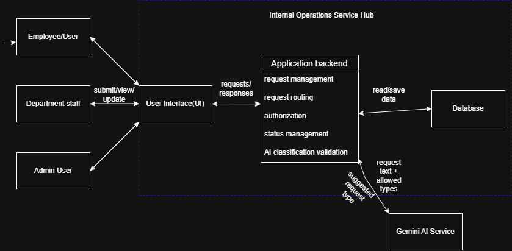

# Internal Operations Service Hub Architecture

## Purpose + Scope

This architecture describes the components, responsibilities, flows, boundaries, and authorization decisions used by the current Internal Operations Service Hub implementation.

The current version focuses on the Service Request workflow, Department routing, request tracking, Department Staff status updates, Employee cancellation, SQLite persistence, automated tests, and AI-assisted Request Type classification.

Some parts of the wider product vision, such as full authentication and Admin management, are not implemented in the current version.

## Requirements for the Design

- Employees can submit internal Requests.
- Employees can view and track their submitted Requests.
- Employees can cancel their own active Requests.
- The system routes each Request to the correct Department or review destination based on Request Type.
- Department Staff can view Requests for a selected Department.
- Department Staff can update the status of Requests assigned to their Department.
- Invalid Request status transitions must be rejected.
- Employees can submit free-text descriptions for AI-assisted Request Type classification.
- AI-assisted classification must only return one of the Request Types allowed by the AI workflow.
- AI failure or invalid output must not cause a Request to be saved.
- Request ownership and Department update rules are checked by the Backend.

## Actors

- Employee / User: submits Requests, tracks them, and can cancel their own active Requests.
- Department Staff: views Requests for a Department and updates Requests assigned to that Department.
- Admin User: part of the intended wider product scope, but Admin management functionality is not implemented in the current version.

## System Boundaries

### Inside the System

- React Employee Portal.
- React Department Staff Portal.
- NestJS Application Backend.
- Request creation and validation.
- Request Type to Department routing.
- Request ownership checks.
- Department-based status update checks.
- Request lifecycle management.
- Employee Request cancellation.
- AI classification validation.
- SQLite persistence for Service Requests.

### Outside the System

- Employees.
- Department Staff.
- Future Admin users.
- The actual work performed by IT, HR, Finance, or other departments.
- Internet connection.
- Gemini AI Service used to suggest a Request Type from an Employee's free-text request.

## Structure + Flow

### Main Components

- User Interface: React frontend containing the Employee Portal and Department Staff Portal.
- Application Backend: NestJS backend that handles Request creation, routing, tracking, cancellation, status updates, authorization checks, AI validation, and persistence.
- AI Request Classifier: sends minimal Request context to Gemini and receives a suggested Request Type.
- Database: SQLite database that stores Service Request records.

## Component Responsibilities

### User Interface

The current React frontend:

- allows Employees to submit Requests manually,
- allows Employees to submit Requests using AI-assisted classification,
- allows Employees to view their previous Requests,
- allows Employees to see Request status,
- allows Employees to cancel active Requests,
- allows Department Staff to view Requests for a selected Department,
- allows Department Staff to update Request status.

The current frontend includes a development-only switch between the Employee Portal and Department Staff Portal.

The Staff Portal currently allows the Department to be selected manually for demonstration purposes.

A production version would determine the displayed portal and Department from the authenticated user's identity and role.

### Application Backend

The NestJS Backend:

- receives and validates Request creation operations,
- applies the Request Type to Department mapping,
- saves Service Requests,
- retrieves Requests created by an Employee,
- checks Request ownership when an Employee accesses an individual Request,
- allows Employees to cancel their own active Requests,
- retrieves Requests by Department,
- checks the supplied Department before allowing Staff status updates,
- validates Request status transitions,
- sends only the required Request text and allowed Request Types to the AI classifier,
- validates the AI classification result before using it,
- keeps Request Type to Department routing inside the Backend,
- prevents the AI Service from writing directly to the Database.

Current manual routing is:

- `Password Reset -> IT`
- `Leave Request -> HR`
- `Reimbursement -> Finance`
- `Other -> Admin Review`

AI-assisted classification supports only:

- Password Reset
- Leave Request
- Reimbursement

`Other` is a manual fallback and is not returned by the AI classifier.

### AI Request Classifier

The AI Request Classifier:

- receives the Employee Request text,
- receives the list of allowed AI Request Types,
- sends the minimum required context to Gemini,
- receives a suggested Request Type,
- returns the suggestion to the Application Backend.

The AI classifier does not receive:

- Department routing mappings,
- Employee IDs,
- Department Staff identity,
- authorization information,
- Request status information,
- Database records.

The AI Service does not write directly to the Database.

### Database

The current SQLite Database stores Service Request records.

Each stored Service Request contains:

- Request ID,
- Request Type,
- Department or review destination,
- description,
- status,
- creator identifier.

The current implementation does not have separate database tables for:

- Users,
- Departments,
- Request Types,
- roles,
- Staff Department assignments.

Request Type to Department mappings are currently owned by the Application Backend rather than stored in the Database.

## Main Flow

### Standard Request Submission Flow

1. The Employee selects a Request Type and enters a description in the User Interface.
2. The User Interface sends the Request to the Application Backend.
3. The Backend validates the Request Type.
4. The Backend finds the correct Department or review destination using its product-owned routing mapping.
5. The Backend creates the Request with status `Submitted`.
6. The Request is saved in SQLite.
7. The created Request is returned to the User Interface.
8. The Request appears in the Employee's My Requests panel.

### AI-Assisted Request Submission Flow

1. The Employee enters a free-text Request description.
2. The User Interface sends the text to the Application Backend.
3. The Backend sends only the Employee text and allowed Request Types to the AI Request Classifier.
4. Gemini suggests one Request Type.
5. The Backend validates that the returned value is one of the allowed AI Request Types.
6. If the result is valid, the Backend applies its own Request Type to Department mapping.
7. The Backend creates and saves the Request.
8. The Request is returned to the User Interface.
9. If Gemini fails or returns an invalid Request Type, the Backend returns:

`Unable to classify the request.`

10. When AI classification fails, no Request is saved.

### Employee Request Tracking Flow

1. The Employee Portal requests the current Employee's Requests from the Backend.
2. The current prototype supplies the Employee identity using `x-user-id`.
3. The Backend retrieves Requests with the matching creator identifier.
4. The Requests are returned newest first.
5. The User Interface displays Request Type, Department, description, and status.
6. The Employee can refresh the list to retrieve updated status information.

### Department Staff Request Flow

1. Department Staff opens the Staff Portal.
2. A Department is selected in the current prototype.
3. The User Interface requests Requests assigned to that Department.
4. The Backend retrieves matching Requests.
5. The Staff Portal displays the Requests.

In the current prototype, Department selection is used for demonstration and is not tied to a real authenticated Staff account.

A production version would derive the Department from the authenticated Staff user.

### Status Update Flow

1. Department Staff chooses a Request assigned to their selected Department.
2. The User Interface sends the new status to the Application Backend.
3. The current prototype sends the Department using the `x-department` header.
4. The Backend loads the Request.
5. The Backend checks that the supplied Department matches the Request's Department.
6. The Backend validates the requested status transition.
7. The new status is saved.
8. The updated status is returned to the Staff Portal.
9. When the Employee refreshes My Requests, the new status is displayed.

Allowed Staff transitions are:

`Submitted -> In Progress`

`In Progress -> Completed`

Other Staff transitions are rejected.

### Request Cancellation Flow

1. The Employee selects one of their own active Requests.
2. The User Interface sends a cancellation Request to the Application Backend.
3. The current prototype identifies the Employee using `x-user-id`.
4. The Backend loads the Request.
5. The Backend checks that the Request belongs to that Employee.
6. The Backend checks that the Request is not `Completed` or already `Cancelled`.
7. The status is changed to `Cancelled`.
8. The updated status is saved.
9. The Employee Portal displays the cancelled status.

Allowed Employee cancellation transitions are:

`Submitted -> Cancelled`

`In Progress -> Cancelled`

`Completed` and `Cancelled` are terminal states.

## Trust + Resilience

### Current Authorization Model

The current implementation demonstrates authorization rules without implementing full authentication.

Employee identity is simulated using:

`x-user-id`

Department Staff identity is simulated using:

`x-department`

Current Backend checks include:

- an Employee can only retrieve an individual Request they created,
- an Employee can only cancel their own Request,
- a Department Staff status update is rejected if the supplied Department does not match the Request's Department,
- invalid Request status transitions are rejected.

The current Department Request listing endpoint retrieves Requests using the Department provided in the request path.

Because there is no full authentication system yet, the current headers and Department selection should be treated as development and demonstration mechanisms rather than production identity controls.

In a production version:

- users would authenticate securely,
- Employee ID would come from the authenticated identity,
- Staff role and Department would come from the authenticated identity,
- users would not provide their own identity or Department through request headers,
- the correct frontend portal would be selected according to the authenticated user's role.

### AI Trust Boundary

Employee Request text is treated as untrusted input.

The AI:

- does not control Department routing,
- does not receive Department routing mappings,
- cannot write directly to the Database,
- cannot choose arbitrary Request Types accepted by the Backend.

The Backend validates every AI classification result at runtime.

Only these AI Request Types can be accepted:

- Password Reset
- Leave Request
- Reimbursement

If the AI returns any other value, the Request is rejected and not saved.

### Reliability / Failure Handling

- If Request creation fails, the User Interface displays an error rather than a successful submission message.
- If the Backend rejects an operation, the frontend displays an error.
- Invalid status transitions are rejected.
- Department mismatches during Staff status updates return a forbidden response.
- Employees cannot cancel Requests that are already `Completed` or `Cancelled`.
- If Gemini fails or returns an invalid Request Type, the Backend returns the stable message:

`Unable to classify the request.`

- AI classification failure does not change the Database state.
- The system is designed to return Request status information within the required 2-second period during normal operation.

## Decisions

- Use one NestJS Application Backend for the current system logic.
- Use React for the User Interface.
- Use SQLite for current relational persistence.
- Keep Request Type to Department routing inside the Backend.
- Keep Request lifecycle rules inside the Backend.
- Keep Request ownership and Department update checks inside the Backend.
- Use Gemini only to suggest a Request Type.
- Validate AI output before creating a Request.
- Do not give Gemini access to Database records.
- Do not allow Gemini to write to the Database.
- Keep the current implementation simple rather than adding queues, microservices, or unnecessary infrastructure.

## Communication + Trust Decisions

- Communication between the User Interface and Application Backend is synchronous because users need immediate responses.
- Communication between the Application Backend and SQLite Database is synchronous for the current Request flows.
- Communication between the Application Backend and Gemini is synchronous because the Backend needs the classification before deciding whether a Request can be created.
- Request Type to Department routing is controlled by the Application Backend.
- Request status transitions are controlled by the Application Backend.
- Request ownership checks are controlled by the Application Backend.
- Only the Application Backend communicates directly with the Database.
- Gemini does not communicate directly with the Database.
- The overall business process is asynchronous because an Employee may submit a Request and Department Staff may process it later.

## Current Implementation Limitations

The current version does not include:

- full authentication,
- JWT login,
- persistent User accounts,
- persistent Staff roles,
- persistent Staff Department assignments,
- separate Department database entities,
- separate Request Type database entities,
- Admin management UI,
- Admin CRUD operations,
- production infrastructure.

These can be added in a future production version without changing the core Service Request workflow.

## Traceability

- Employees can submit Requests -> React Employee Portal + NestJS Backend + SQLite.
- Employees can track Requests -> My Requests panel + Backend + SQLite.
- Employees can cancel their own active Requests -> Backend ownership and lifecycle checks.
- Requests must be routed correctly -> Backend Request Type to Department mapping.
- Department Staff can view Department Requests -> Staff Portal + Department Request endpoint.
- Department Staff can update Request status -> Staff Portal + Backend Department check + lifecycle validation.
- Wrong Department status updates must be rejected -> Backend Department validation.
- Invalid status transitions must be rejected -> Backend lifecycle rules.
- Employees can submit free-text Requests for AI-assisted classification -> Backend + AI Request Classifier + Gemini.
- AI output must use an allowed Request Type -> Backend runtime validation.
- Request Type to Department routing remains product-owned -> Backend.
- AI failure must not change stored data -> Backend validates classification before saving.
- Full authentication and Admin management remain future production improvements.

## Architecture Diagram

